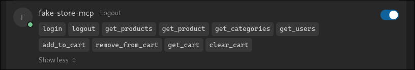
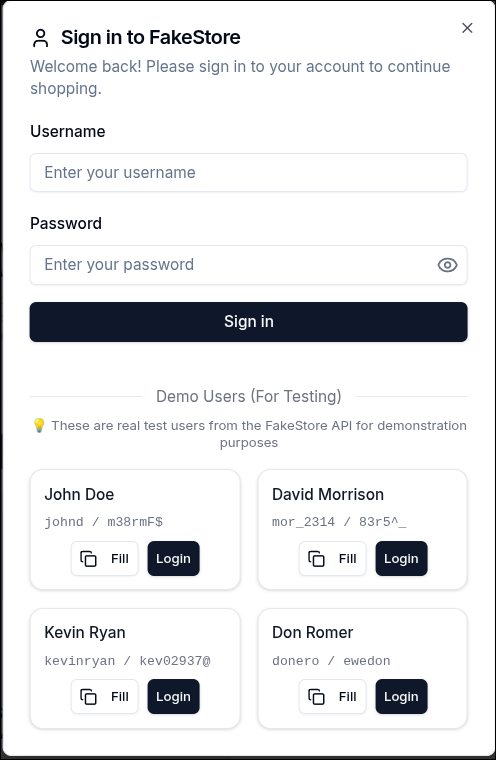
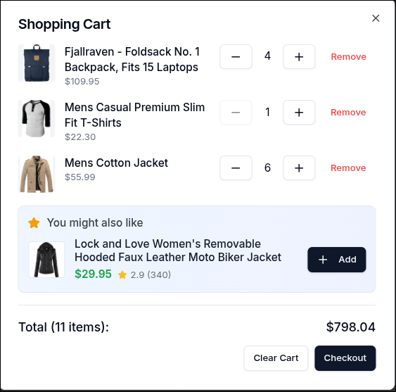

# FakeStore MCP - Model Context Protocol E-commerce Demo

**🚀 LIVE DEMO: https://fakestore-mcp.vercel.app**

A complete e-commerce application demonstrating Model Context Protocol (MCP) integration with the FakeStore API. Built with Next.js, TypeScript, and the MCP TypeScript SDK.

- [FakeStore MCP - Model Context Protocol E-commerce Demo](#fakestore-mcp---model-context-protocol-e-commerce-demo)
  - [Setup Instructions](#setup-instructions)
    - [Prerequisites](#prerequisites)
    - [Development](#development)
  - [Architecture](#architecture)
    - [UI-First Development](#ui-first-development)
    - [Key Design Decisions](#key-design-decisions)
  - [Tech Stack](#tech-stack)
    - [MCP Server](#mcp-server)
      - [Authentication](#authentication)
      - [Products](#products)
      - [Cart Operations](#cart-operations)
    - [Cursor IDE Integration](#cursor-ide-integration)
  - [Features](#features)
    - [Core Functionality](#core-functionality)
  - [Flow](#flow)
    - [User Journey](#user-journey)
    - [Technical Flow](#technical-flow)
  - [Demo Credentials](#demo-credentials)
  - [Extras](#extras)


## Setup Instructions

### Prerequisites
- Node.js 18+
- npm or yarn

### Development
```bash
# Install dependencies
npm install

# Start development server
npm run dev
```

The application will be available at `http://localhost:3000`.

## Architecture

### UI-First Development
1. **Phase 1**: Built working UI with direct FakeStore API integration to explore UX challenges
2. **Phase 2**: Added MCP server layer to wrap proven functionality
3. **Result**: Working product first, then abstraction layer and refactoring

### Key Design Decisions
- **Component Architecture**: Modular React components with clear separation
- **State Management**: React Context for cart, localStorage for persistence
- **Error Handling**: Comprehensive error boundaries and user feedback
- **TypeScript**: Strict typing throughout for reliability
- **Optimistic Updates**: Instant UI feedback with background sync
- **Desktop Only**: Assumed responsive mobile design out of scope for brevity

## Tech Stack
- **Frontend**: Next.js 15, TypeScript, Tailwind CSS, shadcn/ui, React Context + localStorage
- **MCP Server**: [MCP TypeScript SDK](https://github.com/modelcontextprotocol/typescript-sdk)
- **[MCP Client](https://github.com/Mithgroth/fakestore-mcp/blob/main/src/lib/mcp-client.ts)**: Manager class to interact with MCP Server
- **API**: FakeStore API (only external API used), Token authentication, RESTful endpoints

### MCP Server

The MCP server provides all functionality through standardized tools:

#### Authentication
- `login` - User authentication
- `logout` - Session termination

#### Products
- `get_products` - Browse with category filtering
- `get_categories` - List available categories

#### Cart Operations
- `add_to_cart` - Add products to cart
- `remove_from_cart` - Remove products
- `get_cart` - View detailed cart contents
- `clear_cart` - Empty shopping cart

### Cursor IDE Integration
```
AI Assistant → MCP Client → /api/mcp Endpoint → FakeStore API
                                 ↓
            Tool Response ← Cart State ← Database Update
```

The MCP server exposes all cart operations as standardized tools, allowing AI assistants to interact with the shopping cart programmatically.

```json
{
  "mcp": {
    "servers": {
      "fakestore": {
        "endpoint": "https://fakestore-mcp.vercel.app/api/mcp",
        "protocol": "http"
      }
    }
  }
}
```
MCP client should be able to display the tools and ready to consume them:



## Features

### Core Functionality
- ✅ User authentication with session management
- ✅ Product catalog with category browsing and sorting
- ✅ Shopping cart with add/remove/quantity management
- ✅ Optimistic UI updates for instant feedback
- ✅ Desktop design tested in 1440p

## Flow

### User Journey
1. **Browse Products** - Navigate categories, view product details (no auth required)
2. **Add to Cart** - Triggers login modal if not authenticated
3. **Authentication** - User logs in with demo credentials when needed
4. **Cart Management** - Add/remove items with instant UI feedback
5. **Optimistic Updates** - UI updates immediately, syncs in background

> _Traditionally in e-commerce sites, login is postponed until checkout. Since we have no checkout and carts in API are `userId` based, this behaviour is moved to cart CTAs._

> _Since we have no persistency at API level, sessions are retained in MCP level with [session management](https://modelcontextprotocol.io/docs/concepts/transports#session-management). A hard-refresh (Ctrl+F5) causes session and cart to reset to API values. A logout-login without refreshing the page should persist the cart session. This behaviour is intended._ 

### Technical Flow
```
User Action → React Component → Cart Context → Optimistic UI Update
                                     ↓
            Background Sync → FakeStore API → State Reconciliation
```

## Demo Credentials

Login dialog contains ready-to-use accounts for easy testing:



## Extras

- Product sorting by Rating, Price or Review Count
- Recommendations:
  

> Traditionally in e-commerce systems, recommendations are based on sales data. For this demonstration, we are displaying a product that is not in the cart.